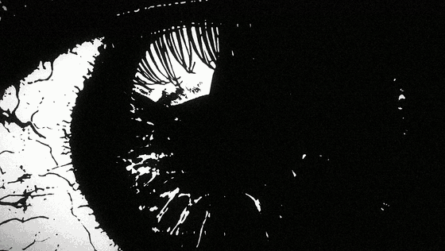
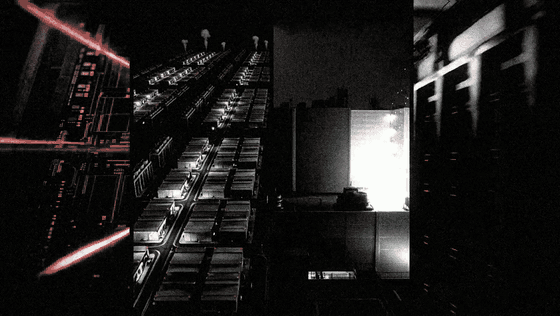
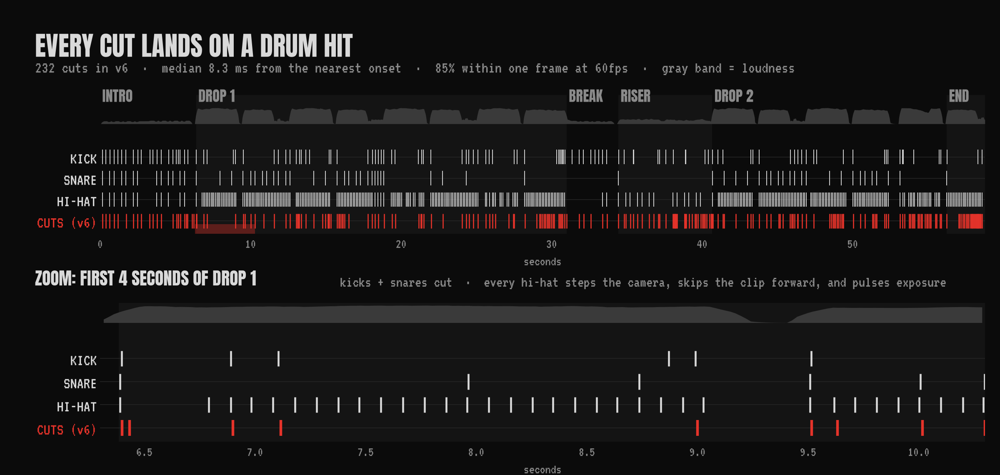
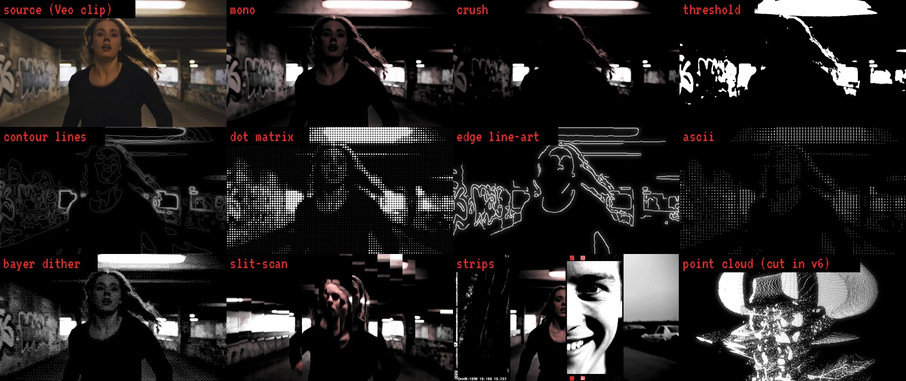
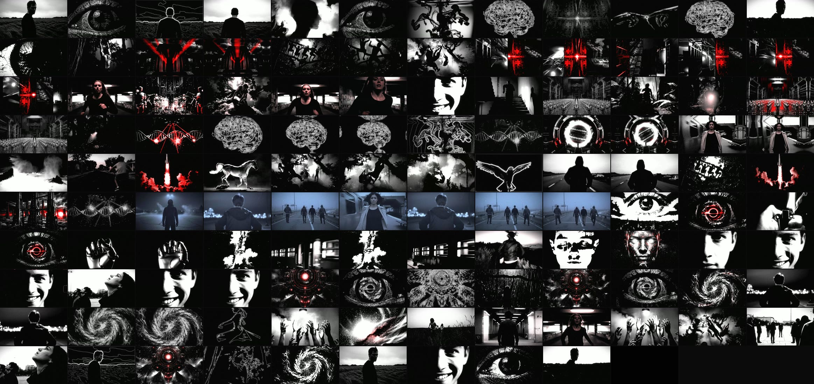
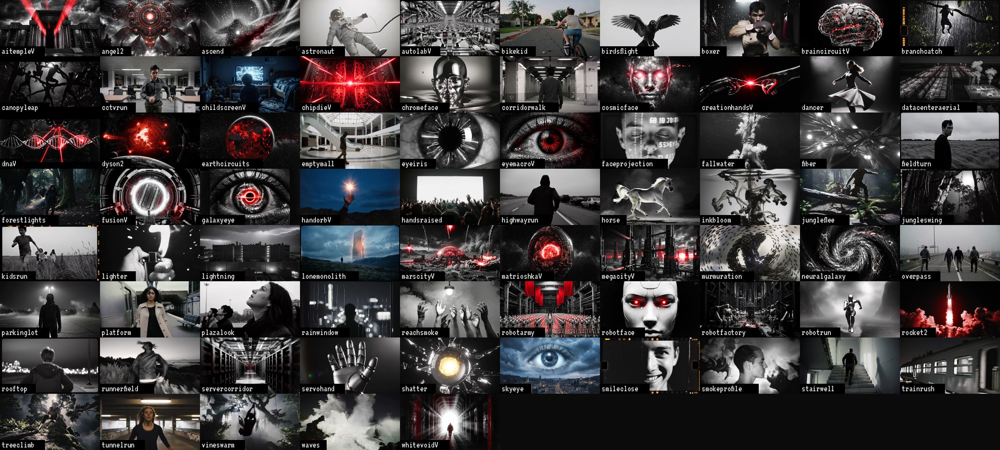

<div align="center">



# ACCELERATE

**A 58-second AGI edit where every cut lands on a drum hit.**

No timeline editor. No After Effects. 75 AI-generated clips, one Python compositor,
and six rounds of brutally honest notes.

`232 cuts` · `8.3 ms median sync to the drums` · `75 clips` · `6 versions` · `~$44 in generation`

</div>

---

## What this is

A hype edit about racing toward AGI and ASI, in the style of the fast, dark, slightly unhinged
edits that do numbers on X. It was made by a human director (me) and Claude Code working in a
terminal: I gave the notes, Claude wrote and ran everything, then watched its own output frame
by frame and fixed what was off.

The interesting part is not the final video. It is the **engine**: a beat-locked compositor that
reads the percussion out of the track and makes every kick, snare and hi-hat *do something*.

<table>
<tr>
<td width="50%"></td>
<td width="50%"></td>
</tr>
<tr>
<td align="center"><sub>Drop 2: the machine wakes up, a stranger grins</sub></td>
<td align="center"><sub>Real people, desolate places, cut on the snare</sub></td>
</tr>
</table>

## Make your own: the `schizo-edit` Claude Code skill

The whole workflow is packaged as a Claude Code skill in
[`.claude/skills/schizo-edit/`](.claude/skills/schizo-edit/SKILL.md): the house style (every "do" and
"don't" from six rounds of notes), music analysis, prompt recipes, scene authoring, and how to QC a
render without being able to hear it.

```bash
git clone https://github.com/RomanSlack/accelerate && cd accelerate
claude    # the skill loads automatically inside this repo
# > make a schizo edit to path/to/my_track.mp4 about <your topic>
```

To use it from any folder: `cp -r .claude/skills/schizo-edit ~/.claude/skills/`.

## Every cut lands on a drum hit



The track is split into three bands and each band gets a job:

| Hit | Band | What it does on screen |
|---|---|---|
| **Kick** | 20 to 150 Hz | Hard cut + a zoom punch with a little camera shake |
| **Snare** | 1.2 to 5 kHz | Hard cut, often switching the *treatment* of the same subject (footage to line art to dots) |
| **Hi-hat** | 7 to 16 kHz | No cut. The camera steps forward, the clip skips ahead, exposure pulses |
| **Last bar of a section** | all | Every single onset becomes a cut (the "stutter" into the next part) |

Onsets come from `librosa` onset detection on each band ([`engine/perc.py`](engine/perc.py)).
The cut list is not hand-placed: scenes are lists of `(clip, treatment)` pairs and the drums decide
when to advance ([`engine/render3.py`](engine/render3.py)). Sync was measured on the final render
with ffmpeg scene detection: median 8.3 ms from a cut to the nearest onset, 85% within one frame at 60fps.

## Six versions, one director


Same eight timestamps, every version. The notes that drove each round are in
[**docs/DIRECTORS_NOTES.md**](docs/DIRECTORS_NOTES.md). The short version:

| | The note | The fix |
|---|---|---|
| **v1 → v2** | (self-review) Text too small to read on a phone | Bigger slogans (wrong direction, it turns out) |
| **v2 → v3** | *"Way too much text... less cringe and more artistic. The fast paced parts are what I want the whole video to be, moving on every piece of percussion."* | Deleted every word. Rebuilt the edit around drum onsets. 60fps. |
| **v3 → v4** | *"The repeating glitch effect is super lame... zooming in slowly on still images is so lame. 34 to 41 seconds is absolutely excellent."* | Killed all glitch fx and every still. Animated the stills. Built a generative treatment library. Made 34 to 41s the house style and left it pixel-identical. |
| **v4 → v5** | *"More shots of real people, running around, creepy desolate vibes. The kid watching TV looks super AI generated. The ending is lame. The orb is lame."* | 14 new clips of ordinary people in empty places (Veo for realism). New ending: a hard cut to black and silence one downbeat early. |
| **v5 → v6** | *"The wireframe sphere is still lame. Have it be people swinging in a jungle like monkeys... Too many horses. The rotating dither face: make it a close-up of someone's face, smiling."* | Wireframes and point clouds gone. Humans swinging through a black jungle on the first drop. A real man's slow, wrong smile answers the machine face. |

## The treatments

Every clip can be rendered through any of these, and the snare picks which one.
All of them are ~10 to 30 ms per 1080p frame in NumPy/OpenCV ([`engine/fxgen.py`](engine/fxgen.py)).



## The whole film



## The footage



Everything is AI-generated. Every prompt is in [`prompts/`](prompts), in the order it was made, and `scripts/gen_clips.py` regenerates any of them:

| File | Model | What |
|---|---|---|
| `01_images_nano_banana.jsonl` | Gemini 3.1 Flash Image (Nano Banana 2) | 33 keyframes, b&w with blood-red accents |
| `02_images_gpt_image_2_redos.jsonl` | gpt-image-2 | 5 redos where Nano Banana was weak or refused |
| `03`, `04` | Kling 2.5 Turbo Pro, image-to-video | First animation pass |
| `05` | Kling, text-to-video | Motion-first clips for the percussion pass |
| `06` | Kling, both | Animated the best stills (no more slow zooms) + new b&w footage |
| `07` | Veo 3.1 + Kling | Real people, empty places, 16mm documentary look |
| `08` | Veo 3.1 + Kling | Humans swinging through a black jungle |
| `09` | Veo 3.1 | Extreme close-up faces (the grin) |

The prompt trick that got real-looking people: *"Documentary realism, shot on 16mm film by a
handheld camera, real ordinary people, natural imperfect framing, overcast flat light"*. Veo 3.1
was noticeably better than Kling for anyone close to camera.

## Run it

You bring the music and generate the clips; the engine does the rest.

```bash
pip install -r requirements.txt
scripts/setup_fonts.sh                       # OFL fonts from Google Fonts
scripts/make_music.sh path/to/track.mp4      # -> build/music.wav (bar-aligned 58.8s edit)
python engine/perc.py                        # -> build/perc.json (kick / snare / hat onsets)

export FAL_KEY=...                            # never commit it
python scripts/gen_clips.py prompts/07_real_people_veo_kling.jsonl --dry-run   # cost + payloads
python scripts/gen_clips.py prompts/07_real_people_veo_kling.jsonl             # -> assets/vid/<name>_0.mp4
# (stills for image-to-video come from prompts/01-02 with any image model -> assets/img/<name>_0.png)

python engine/prep.py                        # extract clip frames + audio envelopes
python engine/render3.py stills 6.5 41.5     # preview frames -> build/stills3/
python engine/render3.py video out.mp4       # full 1080p60 render
python scripts/check_render.py out.mp4       # cut-to-drum sync, dark stretches, frame strips
```

A full render takes about 5 minutes on a 16-core CPU with 8 workers and stays around 3 GB of RAM.

| File | Version | Notes |
|---|---|---|
| [`engine/render.py`](engine/render.py) | v1, v2 | Hand-placed timeline, slogans, glitch fx. Kept as the "before". |
| [`engine/render2.py`](engine/render2.py) | v3 | Cut list generated from drum onsets. Still renders 34 to 41s of the final. |
| [`engine/render3.py`](engine/render3.py) | v4 to v6 | Designed scenes, treatment switching on snares, the ending. |
| [`engine/fxgen.py`](engine/fxgen.py) | | Contours, dot matrix, ascii, edges, slit-scan, strips, iris, tunnel, point cloud |
| [`engine/perc.py`](engine/perc.py) | | Three-band onset detection |
| [`engine/analyze.py`](engine/analyze.py), [`engine/drops.py`](engine/drops.py) | | Tempo, energy curve, exact drop timing, used to choose the bar-line cuts |
| [`scripts/gen_clips.py`](scripts/gen_clips.py) | | fal.ai batch generator for the prompt files (Kling 2.5 Turbo Pro, Veo 3.1) |
| [`scripts/check_render.py`](scripts/check_render.py) | | QC without ears: sync stats, off-beat cuts, dark stretches, frame strips |

## Things we learned the hard way

- **Glitch effects read as cheap.** RGB split, slice bars and echo trails were the first thing cut.
- **A slow zoom on a still is a slideshow.** Animate every still or don't use it.
- **Slogans are cringe.** The version with zero words is the one that works.
- **Screensaver geometry is lame.** Wireframe spheres and rotating point clouds lost to real humans doing strange things.
- **Real faces beat AI faces.** One close-up of a man slowly smiling does more than any cosmic machine.
- **End early.** A hard cut to black and silence one downbeat before the hit lands is better than any fade.
- **Beat trackers love half-time.** The track is 154 BPM; librosa reported 76. The engine's "beat" is two real beats.
- **Chroma split on a 1-bit frame turns it green.** 4:2:0 chroma subsampling smears the red/blue offsets. Only split colour on non-binary frames.
- **Mind your RAM.** 15 render workers each caching full-res frames took the machine down. 8 workers with bounded caches: 3 GB.

## Music

**warhorse** by **fuyomo** ([listen on YouTube](https://www.youtube.com/watch?v=zI9-1F5-A5M)), 154 BPM, G major.

The beat is *free for non-profit use only; monetized tracks without a lease will be hit with copyright*.
It is **not included** in this repo, and none of the GIFs here have audio. If you publish a
monetized video with it, get a lease from fuyomo first.

## Credits

- Direction, taste and every note: [@RomanSlack](https://github.com/RomanSlack)
- Code, renders and frame-by-frame review: [Claude Code](https://claude.com/claude-code)
- Music: fuyomo
- Fonts: Anton, VT323, Bebas Neue, Monoton, UnifrakturMaguntia (SIL Open Font License)

Code is MIT licensed. Generated footage is not included.
