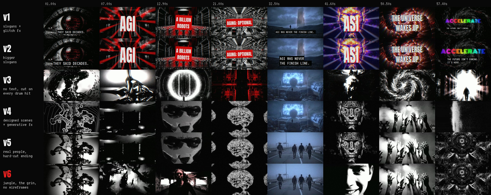
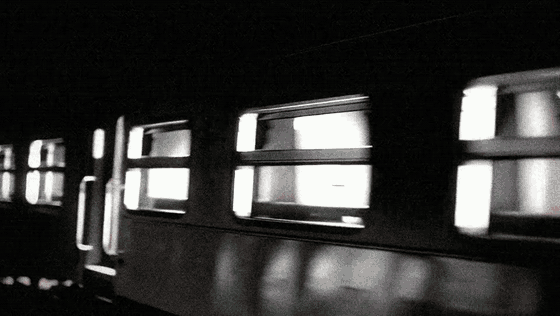

# Director's notes

The full feedback loop, round by round. The notes are the director's, lightly cleaned up for typos.
The fixes are what changed in the code.

---

## The brief

> Make the most killer AI acceleration video you can from this song. An edit that would blow up on X.
> Really highlight us going into the future with AGI, ASI, insane visuals, nearly schizophrenic.
> Sub one minute, a captivating build-up, and a drop early to hook people.

Two reference edits: a type-beat visualizer (for the music and the lo-fi texture) and a meme edit
(for the pace and the propaganda energy).

**Structure decided up front:** the drop in the original track is at 6.4 s, so it stays there as the
hook. One bar of the breakdown is kept, five are skipped, and the riser leads into the second drop at
40.7 s. Both cut points sit on bar lines so the music never stumbles.

---

## v1 and v2: slogans

Big stamped text over red-and-black propaganda stills: `AGI`, `A BILLION ROBOTS`, `CANCER: SOLVED`,
`AGING: OPTIONAL`, a year counter, glitch on every kick, and a rainbow neon `ACCELERATE` end card.

v2 made the text bigger.

> **Note:** Not what I had in mind at all. Way too much text. The fast-paced parts are what I want
> the whole video to be, moving on each and every piece of percussion. Less cringe and more artistic.

**Fix (v3):**
- Every word deleted.
- The track split into kick, snare and hi-hat bands. Kicks and snares cut, and every hi-hat moves
  the camera. 189 cuts.
- 60fps so each hi-hat gets clean motion.
- 15 new clips picked for movement (a flock, liquid chrome, a lighter, a robot fist).

---

## v3: every hit

> **Note:** It has the schizophrenic feeling, but elements take you out of it. The repeating glitch
> effect is super lame. There's a lack of creativity and actual design. The way people do this right
> now is visual assets plus going crazy with effects, animating stuff with code. The worst moments are
> when it shows an image of people just standing there, and zooming in slowly on still images. It keeps
> repeating the same things. The robot running at the screen looks weird and bad.
>
> But 34 to 41 seconds is absolutely excellent. That's really creative.

What 34 to 41 s had in common: stark black and white, tactile human imagery, cuts on every pluck, and
**zero digital glitch**.

**Fix (v4):**
- That section became the house style, and it is rendered by the exact same code so it stays
  pixel-identical.
- No glitch fx anywhere. No stills: 14 of the best ones animated, plus 10 new b&w clips.
- A generative treatment library (contour lines, dot matrix, edges, point cloud, slit-scan, strips,
  iris masks), and scenes built by hand where each snare switches the treatment of the same subject.

---

## v4: designed scenes

> **Note:** More shots of real people, realistic, running around, sort of creepy desolate vibes. The
> kid watching the TV looks super AI generated and is static, so it's bad. Getting closer though.
>
> The ending is lame too. And that orb thing is pretty lame; that it shows for a while is lame.

**Fix (v5):**
- 14 clips of ordinary people in empty places: a woman sprinting through an underpass, a hooded runner
  on an empty highway, kids running into tall grass, a crowd in a plaza all stopping to look up. Veo
  3.1 for anyone close to camera.
- The breakdown rebuilt from them, with the kid gone.
- Every orb gone.
- New ending: the man from the opening field has turned to stare at you, then a barrage of every face
  in the film, then a hard cut to black and silence on the downbeat. The hit never lands.

---

## v5: real people

> **Note:** The wireframe sphere thing is still lame. Have it be people swinging in a jungle like
> monkeys or something crazy like that. Humans though, all fast, dark aesthetic.
>
> The scenes of the horse are too plentiful. And the face with the dither that pitches and yaws around
> is lame. Have that be a close-up video of someone's face, smiling or something. Something creative.

**Fix (v6):**
- The first drop now hits on humans swinging vine to vine through a black, moonlit jungle.
- Wireframes and point clouds removed everywhere. The horse went from about ten appearances to two.
- A Veo close-up of a man who stares blankly, then slowly breaks into a wide smile that doesn't reach
  his eyes. At the second drop it alternates with the cosmic machine face, and the grin grows across
  the cuts.

